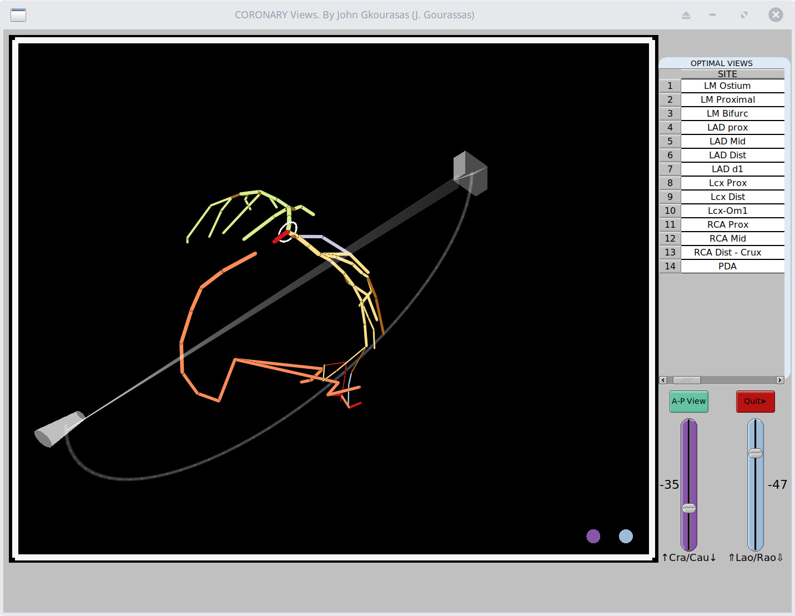

## CORSIM Is a simple simulation of  Coronary arteries - Coronary Angiography

### Developed In Rust - OpenGl - Fltk-rs

### For Optimal Fluoroscopic Viewing Angles of Coronary Artery Ostia and Bifurcations

1. LM Ostium LAO 37, CRA 22
2. LM Proximal LAO 1, CRA 37
3. RCA Ostium LAO 64, CAU 51
4. RCA Proximal LAO 79, CRA 41
5. BIFURCATION LM-LAD-LCx = LAO 0, CAU 49
6. LAD-Diagonal = LAO 11, CRA 71
7. LCx-OM LAO 24, CAU 33
8. PDA-PL LAO 44, CRA 34

